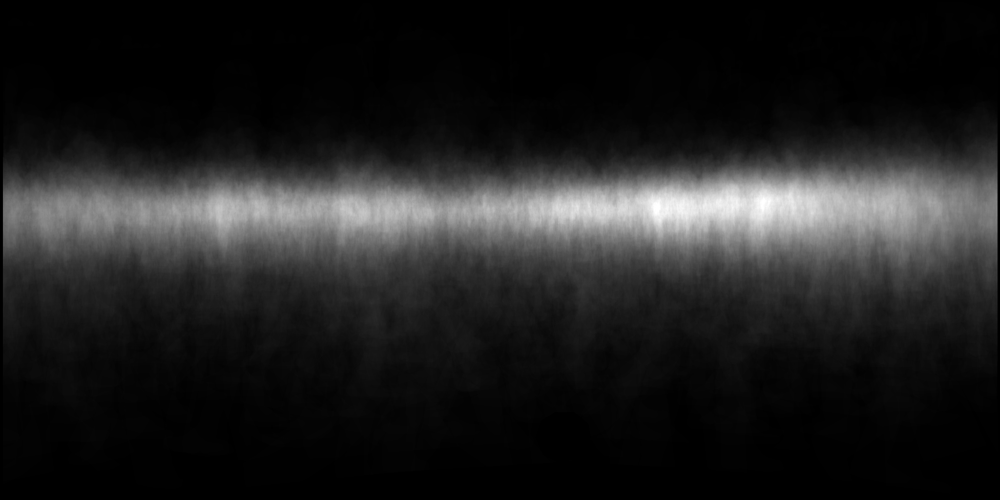
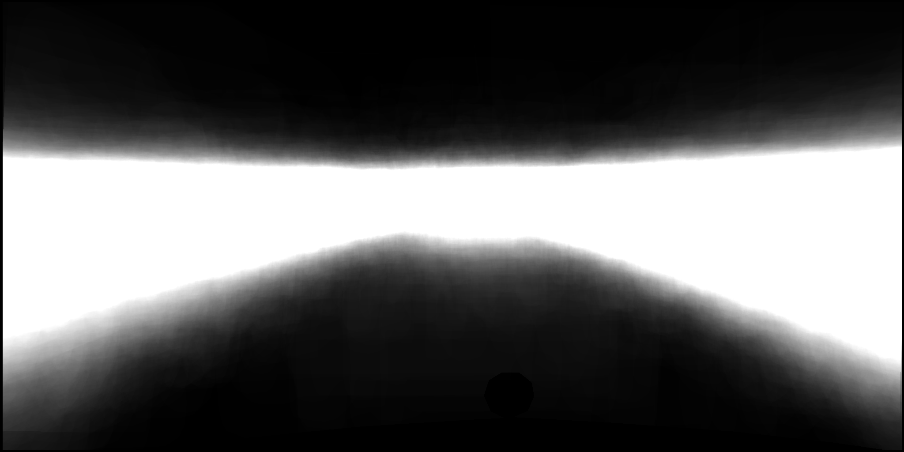
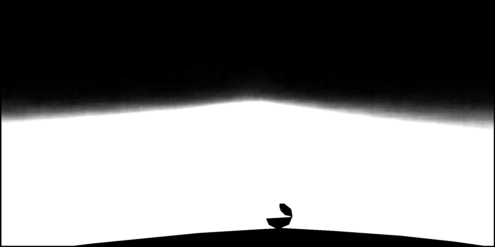
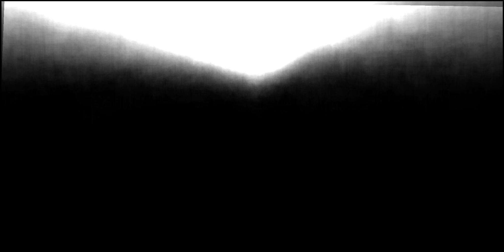

## Road_Scenes_Spatial_Priors_Generator
This repo is mainly for generating spatial priors
which are commonly prevalent in road scene datasets like Cityscapes, IDD, and others.

Due to the inherent structure present in the images in the above mentioned datasets, we
can generate a heatmap corresponding to each pixel based on the labels.

### Cityscapes SP:
| person |      car      |    road    |
|:------:|:-------------:|:----------:|
|        |               |            |
|   sky  | traffic light | motorcycle |
|        |               |            |
